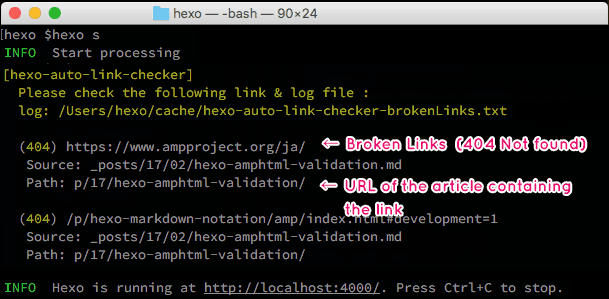

# hexo-auto-link-ckecker

This plugin for [Hexo](https://hexo.io/) can automatically detects broken links.


## Installation

``` bash
$ npm install hexo-auto-link-ckecker --save
```

## Usage

``` bash
$ hexo clean
$ hexo s
```

The parsed link is created in `cache/hexo-auto-link-checker.json` . If there are broken external links, internal links, and TOC, they are displayed in the console message. The link check system is automatically searched one article's link at a time each time `$ hexo s` is executed.



## Option

Please set the following options. Please edit `_config.yml`.

```
# hexo-auto-link-chekcer
autoLinkChecker:
  # enable: false
  rarelyChangePostsPath: 404/
  cachePath: cache/hexo-auto-link-checker.json
  exclusionURL:
    - hoge-url/
    - articles-toc
```

#### enable

Specify false to disable the plug-in.

#### rarelyChangePostsPath

Specify the path of an article that changes less frequently. Necessary for the plug-in to work in all server's situations.

#### cachePath

Save the analysis result of the article as a cache file. It also generates a log file for broken links as `hexa-auto-link-checker-brokenLinks.txt`. Please check the broken URL from the console's message or this txt file.

#### exclusionURL

Specify the URL that you want to exclude from the judgment.


## License

MIT

[Hexo]: http://hexo.io/
